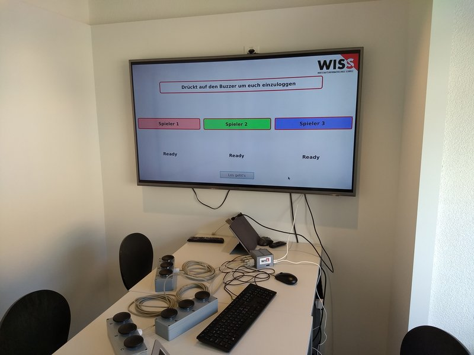
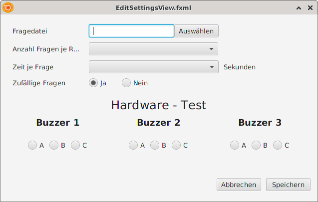
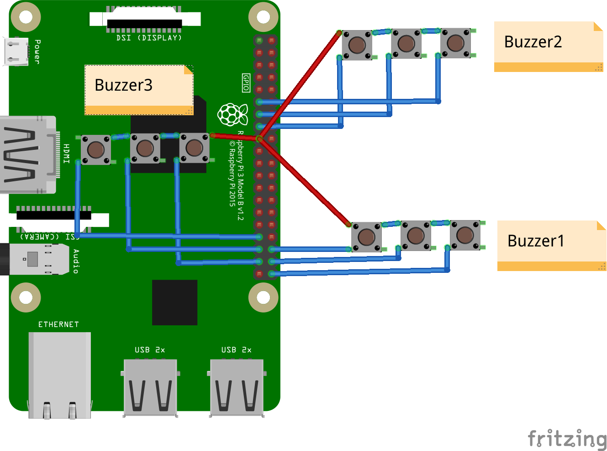

# Buzzer-Game

## Buzzergame - Bedienung



### Nach dem Start des Spiels:
* Spieler melden sich vor jeder Runde durch Drücken ihres Buzzers an, mindestens zwei Spieler
* Frageanzeige wird automatisch beendet nach eingestellter Zeit oder wenn alle beteiligten Spieler eine Antwort abgegeben haben
* Weiterschalten der Ergebnis-Anzeige nach Zeitablauf (10 sek) oder mit Leertaste

### Einstellungen

Unter "Einstellungen bearbeiten" befinden sich folgende Einstellungen
* Fragenkatalog ausgewählen (CSV, kein Excel)
* Anzahl der Fragen je Runde
* Zeit je Frage

Zusätzlich werden alle Tasterzustände der angeschlossenen Buzzern angezeigt.


*

## Raspi-Setup

Aktuelles Passwort: test

### Bildschirmauflösung anpassen

Das BuzzerGame ist optimiert für eine Bildschirmauflösung vom 1600x1000 bis 1920x1080 px (oder ähnlich). Die Bildschirmäuflösung wird auf dem Raspi folgendermassen eingestellt:

1. auf Himbeere oben link klicken, Preferences -> Screen Configuration ausgewählen
2. HDMI-Monitor sollte angezeigt werden, gewünschte Auflösung (Resolution) mit rechtem Mausklick auf Monitorsymbol auswählen

## Development

### Github-Repo:

[https://github.com/greenorca/BuzzerGame_2020_WISS](https://github.com/greenorca/BuzzerGame_2020_WISS)

Die Eclipse-IDE ist derzeit nicht Raspi-tauglich. Alternativ kann mit Geany programmiert werden.

### requirements

wiringpi, openjfx11

### compile

```
mvn javafx:run
```

### package

```
mvn clean compile package
```

### run

```
export OPENJFX=/opt/openjfx/armv6hf-sdk/lib
# or, if openjfx was installed using apt:
export OPENJFX=/usr/share/openjfx/lib

java --module-path $OPENJFX --add-modules javafx.controls,javafx.fxml -jar /home/pi/git/BuzzerGame_2020_WISS/target/IFZ826_LW_Buzzer-0.0.1-SNAPSHOT-jar-with-dependencies.jar application.GameController
```

### Wiring


